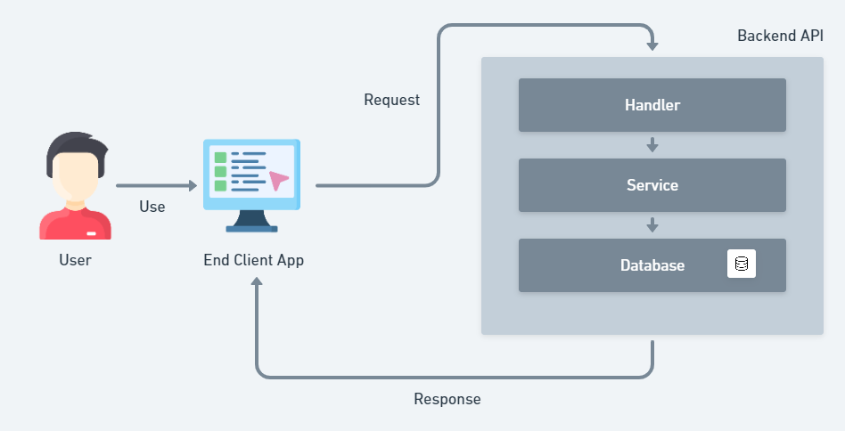
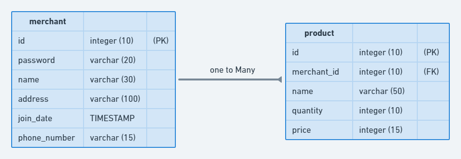

# Simple Architecture Diagram



# ERD of the merchant service data model



# API Contract

## POST /api/merchant/regis

Add an Merchant Account to DB

- **URL Params**
  none
- **Data Params**
  ```
  {
  	"name": string,
  	"password": string,
  	"address": string,
  	"phone": string
  }
  ```
- **Header**
  Content-Type: application/json
- **Success Response:**
  - **Code:** 200
    `{ "register": "success", "name": (name) }`
- **Error Response:**
  - **Code:** 406
    Content: `{ "error": "(name) is Exist on Database" }`

## POST /login

Login to Application

- **URL Params**
  none
- **Data Params**
  none
- **Header**
  Content-Type: application/json
  Authorization: Basic `<Basic Token>`
- **Success Response:**
  - **Code:** 200
    `{ "message": "Logged in successfully 😊 👌" }`
- **Error Response:**
  - **Code:** 403
    Content: `{ "error": "Login Gagal" }`

## POST /api/product/add

Add Product to Merchant

- **URL Params**
  none
- **Data Params**
  ```
  {
  	"mid": string,
  	"name": string,
  	"qty": string,
  	"price": string
  }
  ```
- **Header**
  Content-Type: application/json
  Cookie: access_token=`JWT token`
- **Success Response:**
  - **Code:** 200
    `{ "addProduct": "success", "name": name, "mid": mid }`
- **Error Response:**
  - **Code:** 404
    Content: `{ "error": "Merchant (mid) is Not Exist on Database" }`

## POST /api/product/update

Update Product from Merchant

- **URL Params**
  none
- **Data Params**
  ```
  {
  	"id": string,
  	"mid": string,
  	"name": string,
  	"qty": string,
  	"price": string
  }
  ```
- **Header**
  Content-Type: application/json
  Cookie: access_token=`JWT token`
- **Success Response:**
  - **Code:** 200
    `{ "updateProduct": "success", "product_id": id, "mid": mid }`
- **Error Response:**
  - **Code:** 404
    Content: `{ "error": "Product 16 on Merchant 30 is Not Exist on Database" }`

## GET /api/product/:mid

Show List Product from Merchant

- **URL Params**
  _Required:_ `mid=[integer]`
- **Data Params**
  none
- **Header**
  Content-Type: application/json
  Cookie: access_token=`JWT token`
- **Success Response:**
  - **Code:** 200
    `{ <product_object> }`
- **Error Response:**
  - **Code:** 404
    Content: `{ "error": "Merchant (mid) is Not Exist on Database" }`
    OR
  - **Code:** 404
    Content: `{ "error": "there are no products at this merchant" }`

## DELETE /api/product/delete

Delete Product from Merchant

- **URL Params**
  none
- **Data Params**
  ```
  {
  	"id": string
  }
  ```
- **Header**
  Content-Type: application/json
  Cookie: access_token=`JWT token`
- **Success Response:**
  - **Code:** 200
    `{ "deleteProduct": "success", "id": id }`
- **Error Response:**
  - **Code:** 404
    Content: `{ "error": "Product (id) is Not Exist on Database" }`

## DELETE /api/merchant/delete

Delete Merchant from Database

- **URL Params**
  none
- **Data Params**
  ```
  {
  	"id": string
  }
  ```
- **Header**
  Content-Type: application/json
  Cookie: access_token=`JWT token`
- **Success Response:**
  - **Code:** 200
    `{ "deleteMerchant": "success", "id": id }`
- **Error Response:**
  - **Code:** 404
    Content: `{ "error": "Merchant (mid) is Not Exist on Database" }`

## GET /logout

Delete Merchant from Database

- **URL Params**
  none
- **Data Params**
  none
- **Header**
  Content-Type: application/json
  Cookie: access_token=`JWT token`
- **Success Response:**
  - **Code:** 200
    `{ "message": "Successfully logged out 😏 🍀" }`
- **Error Response:**
  - **Code:** 403
    Content: `Forbidden`
